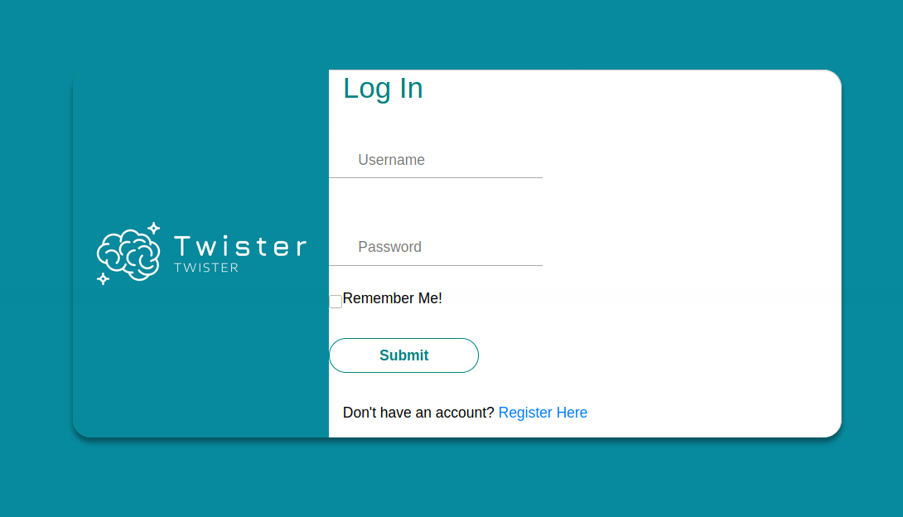

<!-- PROJECT LOGO -->
<br />
<p align="center">
  <a href="https://github.com/YacineAll/Twister">
    
  </a>
  <h3 align="center"><stong>Twister</stong></h3>
  <p align="center">Une application Web de type Twitter.</p>


<!-- TABLE OF CONTENTS -->
## Table of Contents

* [About the Project](#about-the-project)
  * [Built With](#built-with)
* [Getting Started](#getting-started)
  * [Requirement](#Requirement)
  * [Installation](#installation)
* [Contact](#contact)


<!-- ABOUT THE PROJECT -->
## About The Project



Ce réseaux social `Twister` permet à des utilisateurs d’interagir avec d’autres utilisateurs en échangeant des messages, commentaires, et  d'ajouter des amis. 

Ce projet inclut :
* Une interface Web pour les utilisateurs.
* Une API disponible pour le développement d’applications.
* Un serveur permettant le stockage de grandes  masses  de  données  dynamiques.
* Une interface de traitement de données.

### Built With
Au cours de ce projet j'ai utiliser ces technologies:

<ul>
    <li>Interface Web</li>
    <ul>
        <li><a href="https://ant.design">Ant Design</a></li>
        <li><a href="https://getbootstrap.com">Bootstrap</a></li>
        <li><a href="https://react-redux.js.org">React Redux</a></li>
    </ul>
    <li>Serveur</li>
    <ul>
        <li><a href="https://nodejs.org/en/">nodejs</a></li>
        <li><a href="http://tomcat.apache.org/">Apache Tomcat</a></li>
    </ul>
    <li>Base de données</li>
    <ul>
        <li><a href="https://www.mysql.com/">MySQL</a></li>
        <li><a href="https://www.mongodb.com//">mongoDB</a></li>
    </ul>
</ul>

### Requirement

La liste des outils qu'on a besoin pour lancer notre application.

* [Docker](https://docs.docker.com/get-docker/)
* [Docker Compose](https://docs.docker.com/compose/install/)


### Installation

1. Clone the repo
```sh
git clone https://github.com/YacineAll/Twister.git
```
2. Aller sur le dossier Twister
```sh
cd Twister
```
3. Lancer l'application avec `docker-compose`
```sh
docker-compose up
```
4. Aller sur http://127.0.0.1:3000


<!-- CONTACT -->
## Contact

Yacine ALLOUACHE - yacine.allouache@outlook.com

Project Link: [https://github.com/YacineAll/Twister](https://github.com/YacineAll/Twister)


